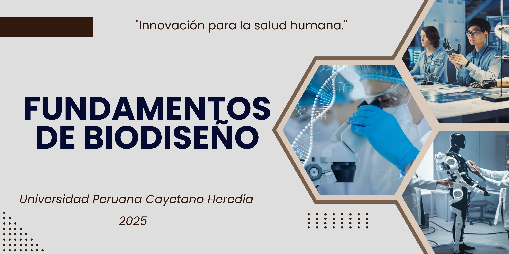
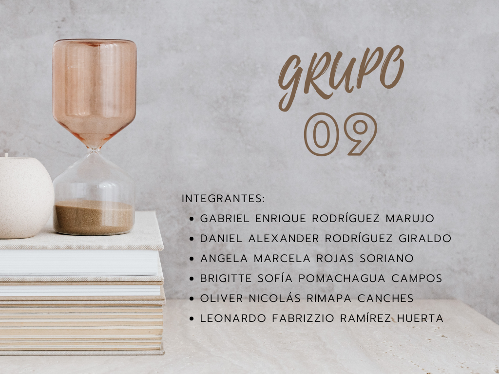
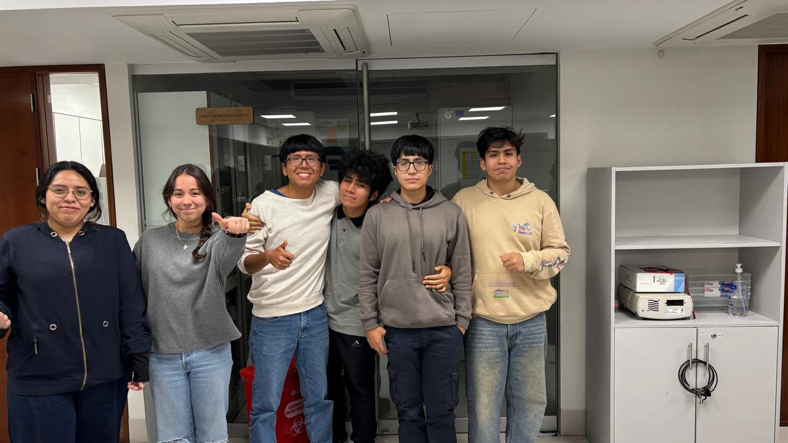
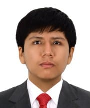
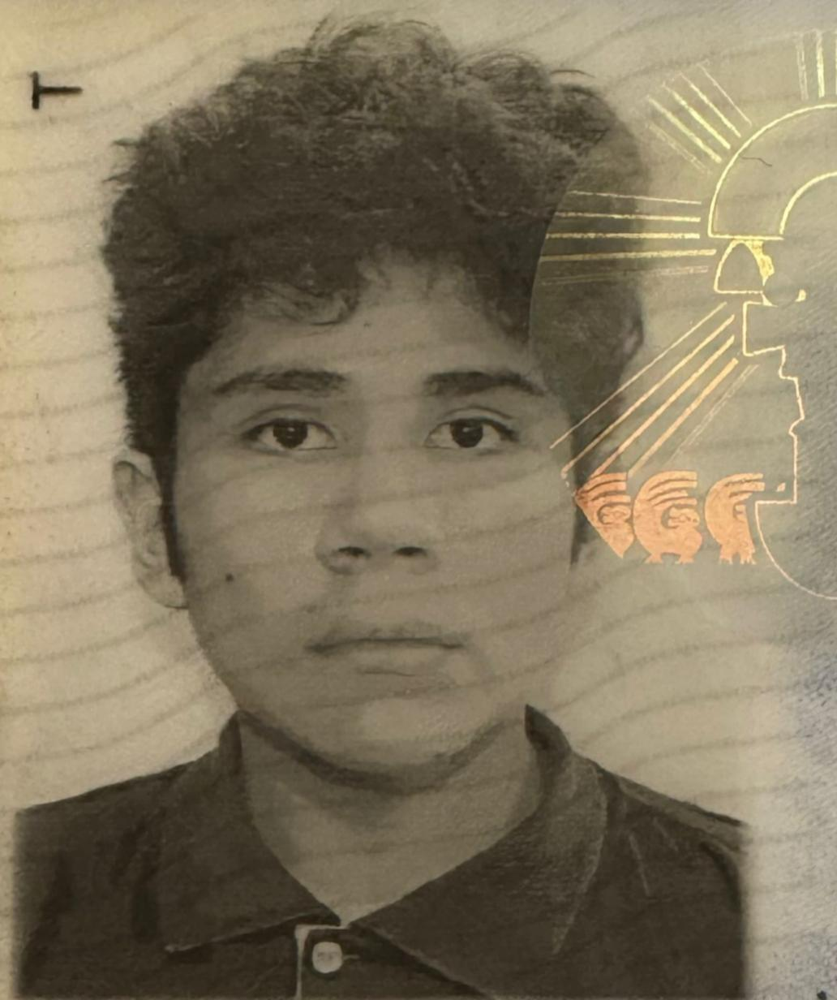
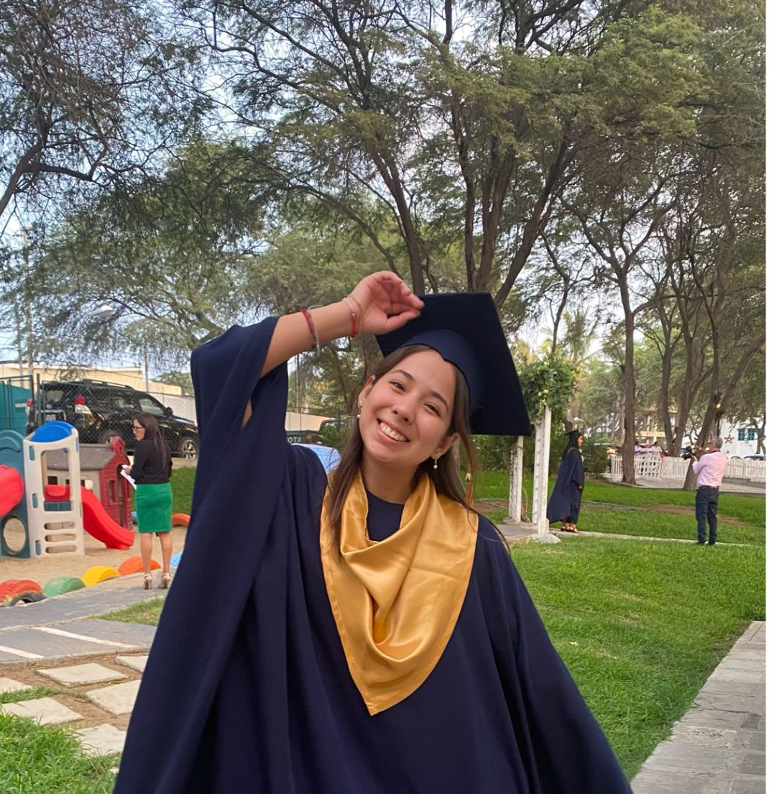
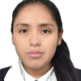
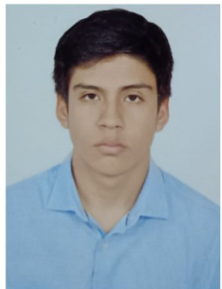

# Fundamentos de Biodiseño – Grupo 09 

  

  

📸 **Foto de Grupo** 

  

👩‍🔬**Sobre nosotros**

Somos el Grupo 09 de Fundamentos de Biodiseño, conformado por estudiantes universitarios comprometidos con el aprendizaje y la innovación.  

> 🎯 **Misión:** Integrar los conocimientos de ciencias básicas y diseño con una mirada **creativa y crítica**.  
> 🌍 **Visión:** Proponer **soluciones sostenibles** a los retos que enfrenta la salud y la sociedad actual.  
> 💡 **Objetivo:** Aprender, aplicar y **crear impacto real** mediante el biodiseño.

📚 **Durante el curso buscamos** 

- 🧠 *Adquirir bases teóricas sólidas* .  
- 🤝 *Desarrollar habilidades de trabajo en equipo, análisis y aplicación práctica*.  
- 🚀 *Formarnos como profesionales preparados para afrontar los futuros desafíos de la ingeniería biomédica** .
  
👥 **Integrantes**   

<table>
  <tr>
    <td width="150px"></td>
    <td>
      <b>Gabriel Enrique Rodríguez Marujo</b>  
       Edad: 18 años  
       🏀 Hábito: Jugar básquet  
       <i>"Espero aprender a analizar diferentes tipos de problemáticas y emplear nuevas metodologías y herramientas para llegar a una solución."</i>  
       <b>Rol:</b> Lider 
    </td>
  </tr>
</table>

---

<table>
  <tr>
    <td width="150px"></td>
    <td>
      <b>Daniel Alexander Rodríguez Giraldo</b>  
       Edad: 19 años  
       🤝 Hábito: Jugar con mis amigos  
       <i>"Espero poder aprender mucho en este curso ya que es afín a nuestra carrera."</i>  
       <b>Rol:</b> Secretario
    </td>
  </tr>
</table>

---

<table>
  <tr>
    <td width="150px"></td>
    <td>
      <b>Angela Marcela Rojas Soriano</b>  
       Edad: 18 años  
       ✈️📸 Hábito: Viajar y tomar fotos  
       <i>"Espero aprovechar al máximo las herramientas que este curso ofrece para usarlas en el futuro de mi desarrollo profesional como ingeniera biomédica."</i>  
       <b>Rol:</b> Diseño
    </td>
  </tr>
</table>

---

<table>
  <tr>
    <td width="150px"></td>
    <td>
      <b>Brigitte Sofía Pomachagua Campos</b>  
       Edad: 18 años  
       🎬🍿 Hábito: Ver series y películas  
       <i>"Deseo adquirir experiencia en biodiseño para futuros proyectos profesionales."</i>  
       <b>Rol:</b> Documentación
    </td>
  </tr>
</table>

---

<table>
  <tr>
    <td width="150px"></td>
    <td>
      <b>Oliver Nicolás Rimapa Canches</b>  
       Edad: 18 años  
       📚📖 Hábito: Leer libros e historietas  
       <i>"Espero aportar ideas innovadoras y aprender de mis compañeros."</i>  
       <b>Rol:</b> Organización
    </td>
  </tr>
</table>

---

<table>
  <tr>
    <td width="150px"></td>
    <td>
      <b>Leonardo Fabrizzio Ramírez Huerta</b>  
       Edad: 18 años  
       🎨 Hábito: Dibujo  
       <i>"Deseo adquirir experiencia en biodiseño para futuros proyectos profesionales."</i>  
       <b>Rol:</b> Logistica
    </td>
  </tr>
</table>

✨ **Compromiso del Grupo** 

*Estamos convencidos de que la innovación nace del trabajo colaborativo.*  
*Nuestro reto es diseñar soluciones creativas que mejoren la salud y la calidad de vida.* 

*Grupo 09 – Fundamentos de Biodiseño*        📍 *Universidad Peruana Cayetano Heredia – 2025* 
